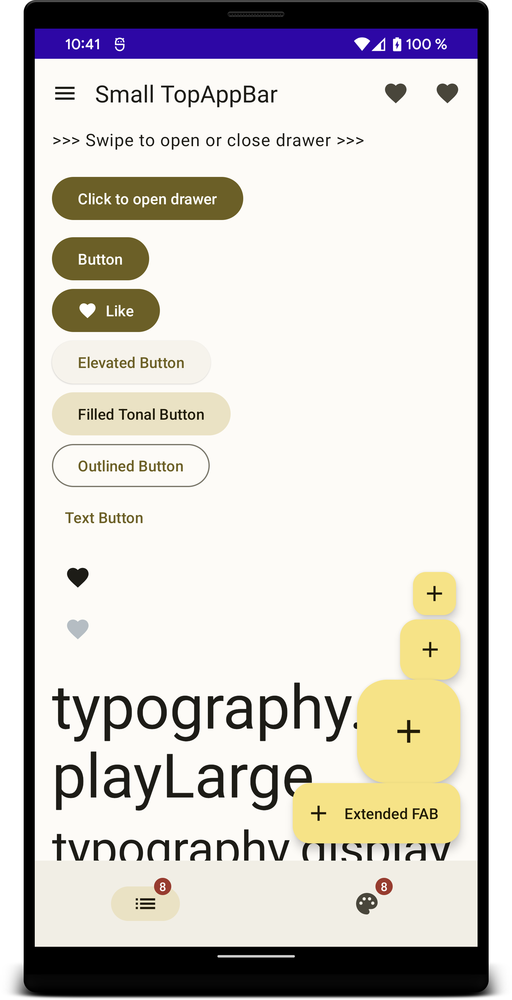

Android material you sample app

This is an app I'm using to play around with the new androidx.compose.material3 Jetpack library.

Material3 is currently only available in androidx snapshot repository. But hopefully released on android dev summit (https://developer.android.com/events/dev-summit). 

```groovy
    repositories {
        google()
        mavenCentral()
        maven { url "https://androidx.dev/snapshots/builds/7850066/artifacts/repository" }
    }
```



